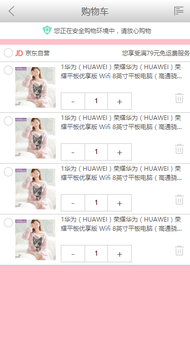
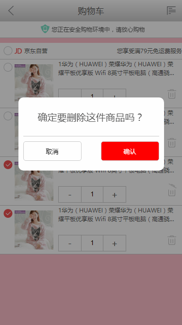

## 仿京东H5

#### 一、目录

index.html

category.html

cart.html

#### 二、技术

##### 百分比布局

除了用px结合媒体查询实现响应式布局外，我们也可以通过百分比单位 " % " 来实现响应式的效果。

比如当浏览器的宽度或者高度发生变化时，通过百分比单位，通过百分比单位可以使得浏览器中的组件的宽和高随着浏览器的变化而变化，从而实现响应式的效果。

如果全部使用百分比单位来实现响应式的布局，有明显的以下两个缺点：

（1）计算困难，如果我们要定义一个元素的宽度和高度，按照设计稿，必须换算成百分比单位。 

（2）各个属性中如果使用百分比，相对父元素的属性并不是唯一的。比如width和height相对于父元素的width和height，而margin、padding不管垂直还是水平方向都相对比父元素的宽度、border-radius则是相对于元素自身等等，造成我们使用百分比单位容易使布局问题变得复杂。

##### banner轮播图

浮动版: 需要在首尾各加一张假图, 才能实现无缝轮播

定位版: 固定三个位置, 控制好index即可

##### 区域滚动--iScroll

iScroll是一个高性能，资源占用少，无依赖，多平台的javascript滚动插件。

它可以在桌面，移动设备和智能电视平台上工作。它一直在大力优化性能和文件大小以便在新旧设备上提供最顺畅的体验。

iScroll不仅仅是 滚动。它可以处理任何需要与用户进行移动交互的元素。在你的项目中包含仅仅4kb大小的iScroll，你的项目便拥有了滚动，缩放，平移，无限滚动，视差滚动，旋转功能。

iScroll使用注意事项:

1. 必须要有很长的子元素, 要有一个有宽高的父容器

2. 父容器只能有一个子元素, 如果有多个, 其他将会被忽略

3. (1) 需要在 onload 中, onload 可以保证图片加载完了, 进行 iScroll 初始化,那么计算子盒子宽高时, 才是准确的
   (2) 需要清除浮动, 保证计算准确

#### 三、效果

##### 首页

##### 

##### 分类页

##### 

##### 购物车

